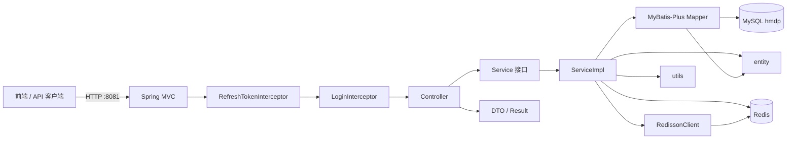
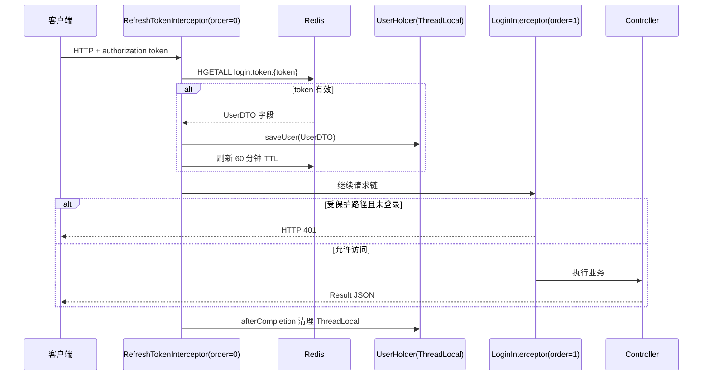
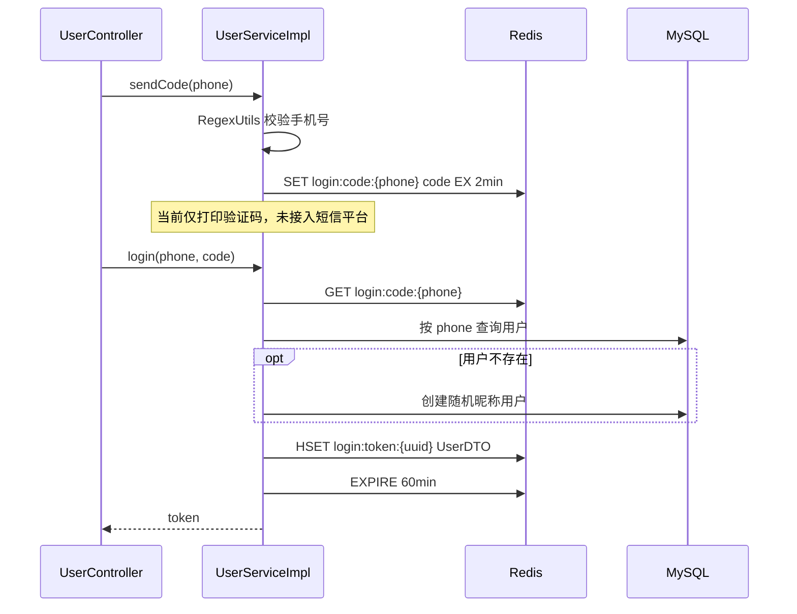
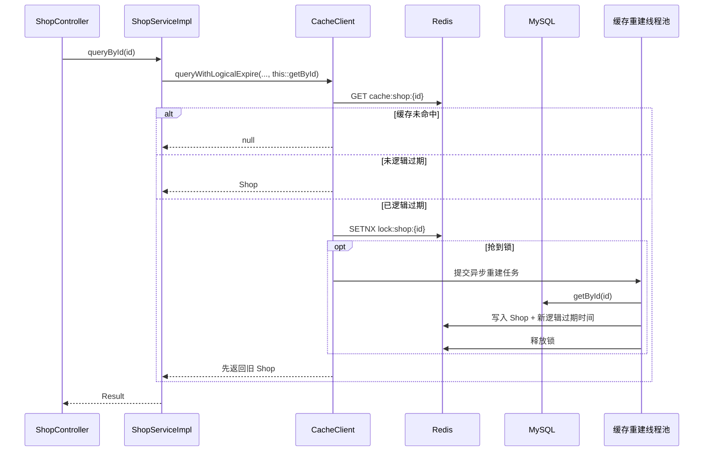
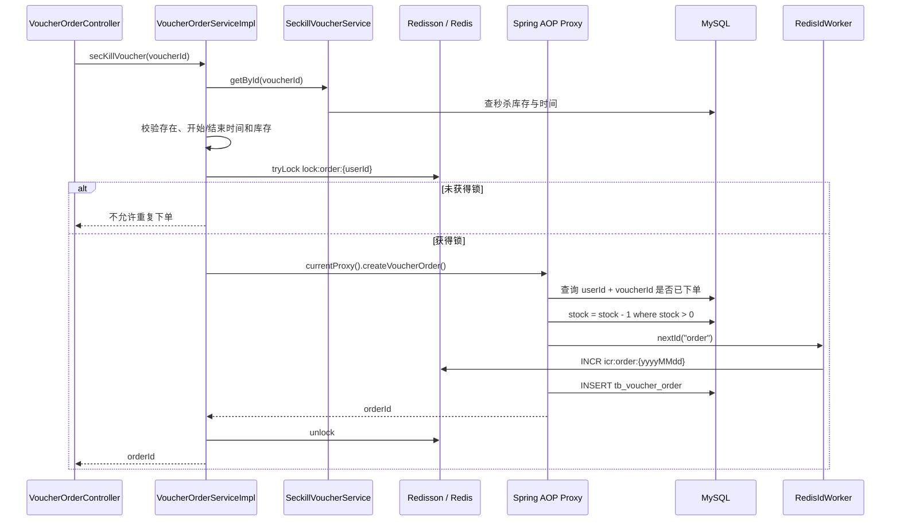
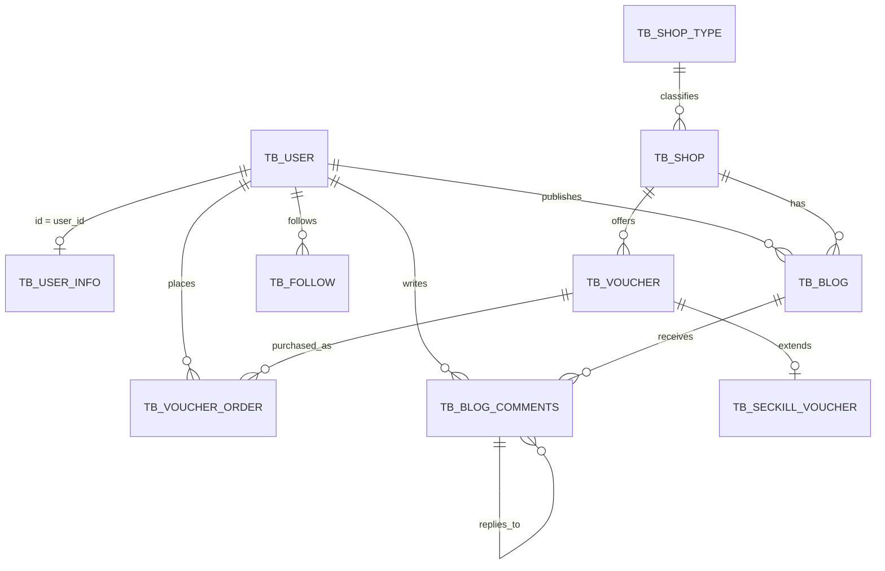

# hm-dianping 项目架构分析

> 本文档根据 2026-09-23 当前工作区源码生成。它描述的是「现在实际存在的代码」，不是黑马点评完整课程的目标版本。

## 1. 项目定位

`hm-dianping` 是一个基于 Spring Boot 的单体后端应用，主要用于演示商铺点评类业务中的 Redis 应用、登录状态管理、缓存优化和秒杀并发控制。

当前仓库只包含 Java 后端，不包含前端源码。前端通常由独立的 Nginx 静态站点提供，再将 API 请求代理到本项目的 `8081` 端口。

当前源码规模：

- 71 个 Java 文件；
- 9 个 Controller；
- 10 个 Service 接口和 10 个 Service 实现；
- 10 个 Mapper；
- 10 个实体类；
- SQL 脚本定义 11 张表。

## 2. 技术栈

| 领域 | 技术 | 项目中的作用 |
| --- | --- | --- |
| 语言 | Java 8 | 项目编译目标 |
| Web 框架 | Spring Boot 2.3.12 + Spring MVC | REST 接口、依赖注入、全局异常处理 |
| 数据访问 | MyBatis-Plus 3.4.3 | 通用 CRUD、链式查询、分页和条件更新 |
| 数据库 | MySQL | 用户、商铺、博客、优惠券和订单的持久化 |
| 缓存/会话 | Redis + Spring Data Redis | 验证码、Token、商铺缓存、类型缓存和 ID 序列 |
| 分布式锁 | Redisson 3.13.6 | 秒杀下单时的「一人一单」并发串行化 |
| 工具库 | Hutool | JSON、Bean 转换、字符串、UUID、随机数和文件工具 |
| 样板代码 | Lombok | Getter/Setter、构造器和日志字段 |
| 测试 | Spring Boot Test + JUnit 5 | 容器集成测试和 Redis ID 并发测试 |

## 3. 总体架构



这是一个经典的分层单体架构：

1. Controller 接收 HTTP 请求和组装响应。
2. Service 表达业务边界，ServiceImpl 完成业务规则。
3. Mapper 负责与 MySQL 交互。
4. Redis 横跨登录、缓存、分布式锁和 ID 生成等多个业务。
5. Entity 映射数据库表，DTO 只承载接口输入、输出或登录上下文。

## 4. 目录和文件职责

```text
hm-dianping/
├── pom.xml                         Maven 依赖与构建配置
├── src/main/java/com/hmdp/
│   ├── HmDianPingApplication.java    启动类、Mapper 扫描、AOP 代理配置
│   ├── config/                       MVC、MyBatis-Plus、Redisson、异常处理
│   ├── interceptor/                  Token 恢复和登录校验
│   ├── controller/                   HTTP 接口层
│   ├── service/                      业务接口
│   │   └── impl/                     业务实现
│   ├── mapper/                       MyBatis-Plus 数据访问接口
│   ├── entity/                       数据库实体
│   ├── dto/                          接口传输对象
│   └── utils/                        Redis、锁、ID、正则和线程上下文工具
├── src/main/resources/
│   ├── application.yaml              服务、MySQL、Redis、日志配置
│   ├── db/hmdp.sql                   建表和演示数据
│   └── mapper/VoucherMapper.xml      优惠券与秒杀信息联表 SQL
└── src/test/java/com/hmdp/
    └── HmDianPingApplicationTests.java 商铺缓存预热与 ID 并发测试
```

### 4.1 启动与配置文件

| 文件 | 直接关系 | 作用 |
| --- | --- | --- |
| `HmDianPingApplication` | 扫描 `mapper` 包，启用 `exposeProxy` | 启动 Spring 容器；使秒杀服务可通过 `AopContext` 取得当前代理 |
| `MvcConfig` | 注册两个 Interceptor | 令刷新 Token 先执行，登录校验后执行；配置公开路径 |
| `MybatisConfig` | 创建 `MybatisPlusInterceptor` | 为 `Page` 查询提供 MySQL 分页 |
| `RedissonConfig` | 创建 `RedissonClient` | 连接本地 Redis，供秒杀服务获取 `RLock` |
| `WebExceptionAdvice` | 返回 `Result.fail` | 将未处理的 `RuntimeException` 统一转换为失败响应 |
| `application.yaml` | MySQL、Redis、MyBatis-Plus | 定义端口 `8081`、数据源、Redis 连接池和日志级别 |

### 4.2 Controller → Service → Mapper/Entity 对照

| 业务 | Controller | Service / 实现 | Mapper | Entity / 表 |
| --- | --- | --- | --- | --- |
| 用户登录 | `UserController` | `IUserService` → `UserServiceImpl` | `UserMapper` | `User` / `tb_user` |
| 用户详情 | `UserController` | `IUserInfoService` → `UserInfoServiceImpl` | `UserInfoMapper` | `UserInfo` / `tb_user_info` |
| 商铺 | `ShopController` | `IShopService` → `ShopServiceImpl` | `ShopMapper` | `Shop` / `tb_shop` |
| 商铺类型 | `ShopTypeController` | `IShopTypeService` → `ShopTypeServiceImpl` | `ShopTypeMapper` | `ShopType` / `tb_shop_type` |
| 探店博客 | `BlogController` | `IBlogService` → `BlogServiceImpl` | `BlogMapper` | `Blog` / `tb_blog` |
| 博客评论 | `BlogCommentsController` | `IBlogCommentsService` → `BlogCommentsServiceImpl` | `BlogCommentsMapper` | `BlogComments` / `tb_blog_comments` |
| 关注 | `FollowController` | `IFollowService` → `FollowServiceImpl` | `FollowMapper` | `Follow` / `tb_follow` |
| 优惠券 | `VoucherController` | `IVoucherService` → `VoucherServiceImpl` | `VoucherMapper` + XML | `Voucher` / `tb_voucher` |
| 秒杀库存 | 由优惠券/订单服务调用 | `ISeckillVoucherService` → `SeckillVoucherServiceImpl` | `SeckillVoucherMapper` | `SeckillVoucher` / `tb_seckill_voucher` |
| 秒杀订单 | `VoucherOrderController` | `IVoucherOrderService` → `VoucherOrderServiceImpl` | `VoucherOrderMapper` | `VoucherOrder` / `tb_voucher_order` |
| 图片文件 | `UploadController` | 无 Service | 无 | 本地文件系统 |

`BlogCommentsController` 和 `FollowController` 目前没有具体端点；对应 ServiceImpl 也只继承 MyBatis-Plus 通用 CRUD。这些文件是已建立的扩展骨架，不代表功能已完成。

### 4.3 Service 继承关系

```mermaid
classDiagram
    class IService~T~
    class BaseMapper~T~
    class ServiceImpl~M_T_
    class IShopService
    class ShopServiceImpl
    class ShopMapper
    class Shop

    IService <|-- IShopService
    ServiceImpl <|-- ShopServiceImpl
    IShopService <|.. ShopServiceImpl
    BaseMapper <|-- ShopMapper
    ShopServiceImpl --> ShopMapper
    ShopMapper --> Shop
```

其他业务组与商铺组使用相同模式。`ServiceImpl<Mapper, Entity>` 使实现类直接拥有 `save`、`getById`、`query`、`update`等通用方法，因此并非所有数据库访问都会在 Mapper 中显式声明 SQL。

## 5. HTTP 请求和登录链路

### 5.1 拦截器执行顺序



`MvcConfig` 中的登录白名单为：`/shop/**`、`/voucher/**`、`/shop-type/**`、`/upload/**`、`/blog/hot`、`/user/code`、`/user/login`。刷新 Token 拦截器仍处理所有路径，以便在公开接口中也能恢复「可选的当前用户」。

### 5.2 验证码登录



## 6. 核心业务调用链

### 6.1 商铺详情与逻辑过期缓存



相关文件：

- `ShopController` 定义 HTTP 入口；
- `ShopServiceImpl` 选择缓存策略，并以 `this::getById` 将数据库回源函数传给 `CacheClient`；
- `CacheClient` 封装空值缓存、逻辑过期和异步重建；
- `RedisData` 将业务数据与 `expireTime` 包装在一起；
- `RedisConstants` 定义 key 前缀和 TTL；
- `ShopMapper` 由 MyBatis-Plus 代理，最终访问 `tb_shop`。

商铺更新使用 Cache Aside 写法：先 `updateById` 更新 MySQL，再删除 `cache:shop:{id}`。

### 6.2 商铺类型缓存

`ShopTypeController.queryTypeList` → `ShopTypeServiceImpl.getTypeList` → Redis `cache:shop-type` → 未命中时 `ShopTypeMapper.selectList(null)` → `tb_shop_type`。

该链路使用普通 30 分钟 TTL，不使用逻辑过期。

### 6.3 秒杀下单



这条链路同时使用了四层保护：

1. 业务时间与库存快速校验；
2. 以用户 ID 为粒度的 Redisson 分布式锁；
3. 事务中查询「一人一单」；
4. `stock > 0` 条件更新，防止库存超卖。

`createVoucherOrder` 必须通过 `AopContext.currentProxy()` 获取的代理对象调用，否则同类内部直接调用会绕过 Spring 的 `@Transactional` 代理。这也是启动类使用 `@EnableAspectJAutoProxy(exposeProxy = true)` 的原因。

### 6.4 优惠券查询与新增

- 查询：`VoucherController` → `VoucherServiceImpl` → `VoucherMapper.queryVoucherOfShop` → `VoucherMapper.xml`，通过 `LEFT JOIN` 将 `tb_voucher` 和 `tb_seckill_voucher` 组装成一个 `Voucher`。
- 新增秒杀券：`VoucherServiceImpl.addSeckillVoucher` 在同一事务内先保存 `tb_voucher`，再保存共用同一 ID 的 `tb_seckill_voucher`。
- `Voucher.stock`、`beginTime`、`endTime` 使用 `@TableField(exist = false)`，它们不属于 `tb_voucher`，而是联表结果或接口输入的临时字段。

## 7. DTO、Entity 和响应对象

| 类型 | 对象 | 用途 |
| --- | --- | --- |
| 请求 DTO | `LoginFormDTO` | 接收手机号、验证码和预留密码字段 |
| 会话 DTO | `UserDTO` | 仅保留 ID、昵称、头像，写入 Redis 并放入 `UserHolder` |
| 响应 DTO | `Result` | 统一返回 `success`、`errorMsg`、`data`、`total` |
| 滚动分页 DTO | `ScrollResult` | 预留给时间戳 + offset 滚动分页，当前未被调用 |
| 持久化对象 | `entity/*` | 通过 MyBatis-Plus 映射表与列 |

Entity 不应与 DTO 混用：例如登录状态只存 `UserDTO`，可避免把手机号、密码等完整 `User` 信息放入 Token 缓存和线程上下文。

## 8. 数据库模型和表关系

SQL 中没有显式声明外键约束，下图是根据字段和代码调用推导的逻辑关系。



| 表 | 对应 Entity | 核心关系 | 当前代码使用情况 |
| --- | --- | --- | --- |
| `tb_user` | `User` | 用户主表，手机号唯一 | 登录、注册、博客作者 |
| `tb_user_info` | `UserInfo` | 与用户逻辑一对一 | 用户详情查询 |
| `tb_shop_type` | `ShopType` | 一个类型对应多个商铺 | 列表查询及 Redis 缓存 |
| `tb_shop` | `Shop` | 商铺属于一个类型 | 详情、更新、分页查询和缓存 |
| `tb_blog` | `Blog` | 用户发布关于商铺的探店内容 | 发布、点赞计数、我的/热门列表 |
| `tb_blog_comments` | `BlogComments` | 评论关联用户和博客，可自关联回复 | 仅建立分层骨架 |
| `tb_follow` | `Follow` | `user_id` 关注 `follow_user_id` | 仅建立分层骨架 |
| `tb_voucher` | `Voucher` | 商铺的优惠券主表 | 新增与联表查询 |
| `tb_seckill_voucher` | `SeckillVoucher` | 以 `voucher_id` 与优惠券共用主键 | 秒杀时间、库存和条件扣减 |
| `tb_voucher_order` | `VoucherOrder` | 用户购买优惠券形成订单 | 秒杀下单 |
| `tb_sign` | 无 | 用户每日签到 | SQL 已定义，Java 分层尚未实现 |

## 9. Redis 数据模型

| Key 模式 | 类型 | TTL / 生命周期 | 生产者 | 消费者 |
| --- | --- | --- | --- | --- |
| `login:code:{phone}` | String | 2 分钟 | `UserServiceImpl.sendCode` | `UserServiceImpl.login` |
| `login:token:{token}` | Hash | 60 分钟，每次有效请求刷新 | `UserServiceImpl.login` | `RefreshTokenInterceptor` |
| `cache:shop:{id}` | JSON String | 逻辑过期 | 缓存预热/异步重建 | `ShopServiceImpl` + `CacheClient` |
| `cache:shop-type` | JSON String | 30 分钟 | `ShopTypeServiceImpl` | `ShopTypeServiceImpl` |
| `lock:shop:{id}` | String | 20 秒 | `CacheClient` | `CacheClient` |
| `lock:order:{userId}` | Redisson lock | 由 Redisson 管理 | `VoucherOrderServiceImpl` | `VoucherOrderServiceImpl` |
| `icr:{prefix}:{yyyyMMdd}` | String Counter | 代码未设置 TTL | `RedisIdWorker` | `RedisIdWorker` |

`RedisConstants` 还预留了秒杀库存、博客点赞、Feed、GEO 和签到等 key 前缀，但当前代码尚未使用这些能力。

## 10. 当前 HTTP 接口

| 方法 | 路径 | 主要调用 | 登录要求 |
| --- | --- | --- | --- |
| POST | `/user/code` | `UserServiceImpl.sendCode` | 公开 |
| POST | `/user/login` | `UserServiceImpl.login` | 公开 |
| POST | `/user/logout` | 未实现 | 需登录 |
| GET | `/user/me` | `UserHolder.getUser` | 需登录 |
| GET | `/user/info/{id}` | `UserInfoService.getById` | 需登录 |
| GET | `/shop/{id}` | `ShopServiceImpl.queryById` | 公开 |
| POST | `/shop` | `shopService.save` | 公开 |
| PUT | `/shop` | `ShopServiceImpl.updateShop` | 公开 |
| GET | `/shop/of/type` | MyBatis-Plus 分页查询 | 公开 |
| GET | `/shop/of/name` | MyBatis-Plus 模糊分页 | 公开 |
| GET | `/shop-type/list` | `ShopTypeServiceImpl.getTypeList` | 公开 |
| POST | `/blog` | `blogService.save` | 需登录 |
| PUT | `/blog/like/{id}` | `liked = liked + 1` | 需登录 |
| GET | `/blog/of/me` | 当前用户博客分页 | 需登录 |
| GET | `/blog/hot` | 按点赞数降序分页 | 公开 |
| POST | `/voucher` | `voucherService.save` | 公开 |
| POST | `/voucher/seckill` | `addSeckillVoucher` | 公开 |
| GET | `/voucher/list/{shopId}` | 优惠券联表查询 | 公开 |
| POST | `/voucher-order/seckill/{id}` | `secKillVoucher` | 需登录 |
| POST | `/upload/blog` | 写本地文件 | 公开 |
| GET | `/upload/blog/delete` | 删除本地文件 | 公开 |

表中「公开」是对当前 `MvcConfig` 白名单的客观描述，不等于这些写操作在业务上应该公开。

## 11. 工具类之间的关系

| 工具类 | 被谁调用 | 核心责任 |
| --- | --- | --- |
| `CacheClient` | `ShopServiceImpl` | 通用 Redis 缓存读写、空值防穿透、逻辑过期重建 |
| `RedisData` | `CacheClient`、`ShopServiceImpl` | 封装逻辑过期时间与实际数据 |
| `RedisIdWorker` | `VoucherOrderServiceImpl`、测试类 | 用时间戳高 32 位 + Redis 日序列低 32 位生成 ID |
| `UserHolder` | 两个拦截器和多个 Controller/Service | 用 ThreadLocal 传递当前用户 |
| `RegexUtils` / `RegexPatterns` | `UserServiceImpl` | 输入格式校验 |
| `SystemConstants` | Controller | 分页大小、昵称前缀和图片目录 |
| `ILock` / `SimpleRedisLock` | 当前仅有被注释的旧调用 | 教学用自定义 Redis 锁；正式秒杀链路已改用 Redisson |
| `PasswordEncoder` | 当前未调用 | 带随机盐的 MD5 工具，验证码登录链路不使用它 |

## 12. 实现状态与架构风险

以下是对当前代码的现状记录，本次只生成文档，没有修改业务代码。

1. **功能完整度不一**：用户、商铺、博客基础功能和秒杀同步下单已有实现；关注、评论、签到、Feed、GEO、Redis 点赞和异步秒杀尚未实现。
2. **登出未完成**：`POST /user/logout` 固定返回「功能未完成」，不会删除 Redis Token。
3. **权限白名单过宽**：`/shop/**`、`/voucher/**`、`/upload/**` 整段公开，因此新增、更新、上传和删图接口都不要求登录。
4. **配置环境固化**：MySQL 密码、Redis 地址和 Redisson 地址写在源码配置中；`IMAGE_UPLOAD_DIR` 是 Windows 绝对路径，在当前 macOS 环境不能直接使用。
5. **缓存预热是必要前置**：当前商铺详情走逻辑过期方法，Redis 完全未命中时会直接返回 `null`，而不会同步回源 MySQL。
6. **逻辑过期锁有边界问题**：`CacheClient` 在二次检查发现缓存已更新时直接返回，该分支没有释放已获取的锁；自定义锁删除也没有校验锁所有者。
7. **一人一单主要依赖应用逻辑**：`tb_voucher_order` 没有 `(user_id, voucher_id)` 联合唯一索引，目前依靠分布式锁和事务内查询实现。
8. **秒杀是同步链路**：请求线程直接查库、扣库存并写订单，尚未使用 Redis 预扣库存或消息队列削峰。
9. **博客点赞不防重**：当前每次请求直接执行 `liked = liked + 1`，没有用户点赞记录和取消点赞语义。
10. **热门博客存在 N+1 查询**：先分页查博客，然后对每条博客单独查一次用户。
11. **测试是外部依赖集成测试**：现有两个测试需要可用的 Spring 容器、MySQL 和 Redis，且 ID 测试会启动 300 个任务、输出 30000 个 ID，不是轻量单元测试。
12. **自定义锁脚本路径需一致**：`SimpleRedisLock` 加载 `classpath:lua/unlock.lua`，但当前工作区没有可用的 `src/main/resources/lua/unlock.lua`；当前正式秒杀链路不使用此类。

## 13. 阅读代码的建议顺序

1. 从 `pom.xml` 和 `application.yaml` 了解运行环境。
2. 阅读 `HmDianPingApplication` 和 `config/*`，理解容器级行为。
3. 阅读 `MvcConfig` → 两个 Interceptor → `UserHolder`，理解登录上下文。
4. 以 `UserController` → `UserServiceImpl` → Redis/MySQL 掌握登录链路。
5. 以 `ShopController` → `ShopServiceImpl` → `CacheClient` 掌握缓存策略。
6. 以 `VoucherOrderController` → `VoucherOrderServiceImpl` 掌握锁、AOP 事务、条件更新和 ID 生成。
7. 最后对照 Entity、Mapper、XML 和 `hmdp.sql` 理解数据落库。

## 14. 一句话总结

该项目的核心是「Spring MVC 分层业务 + MyBatis-Plus 持久化 + Redis 登录/缓存/并发工具」：基础请求从 Controller 向 Service 和 Mapper 递进，Redis 则作为横切基础设施，串联起 Token、ThreadLocal 用户上下文、逻辑过期缓存、Redisson 锁和全局 ID。
